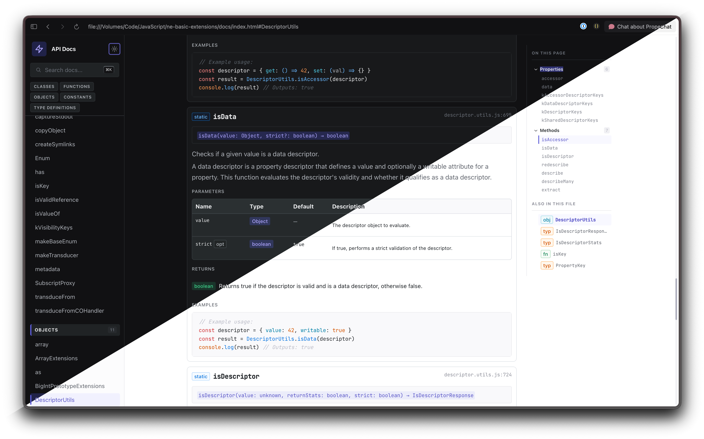
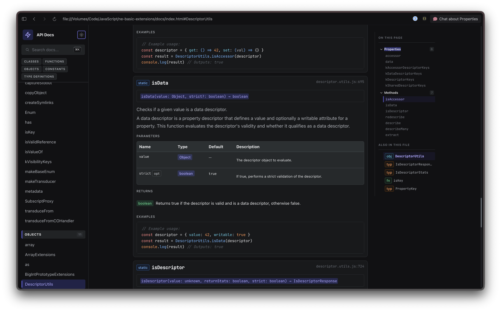
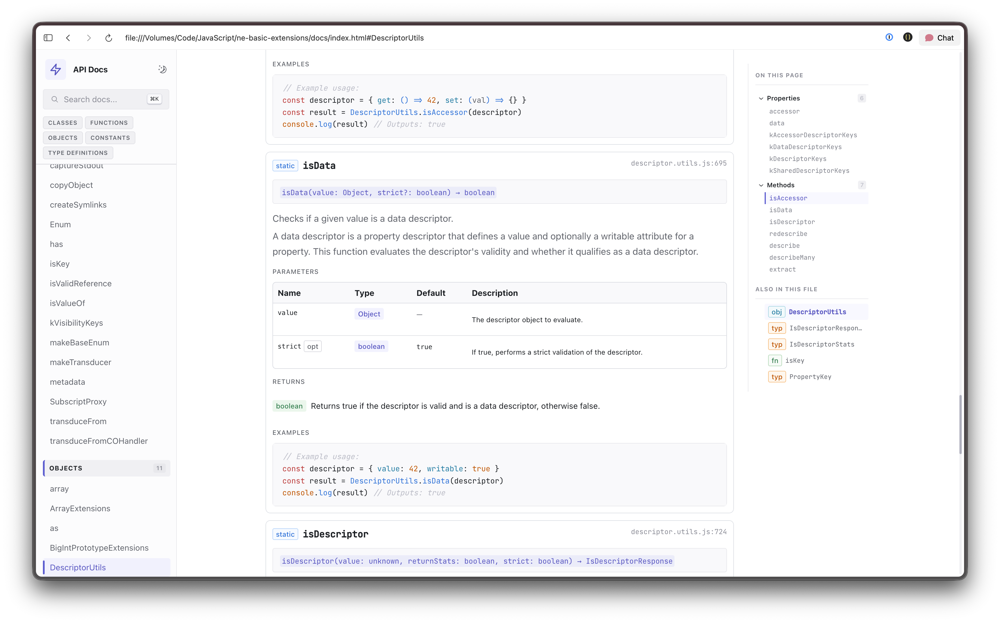
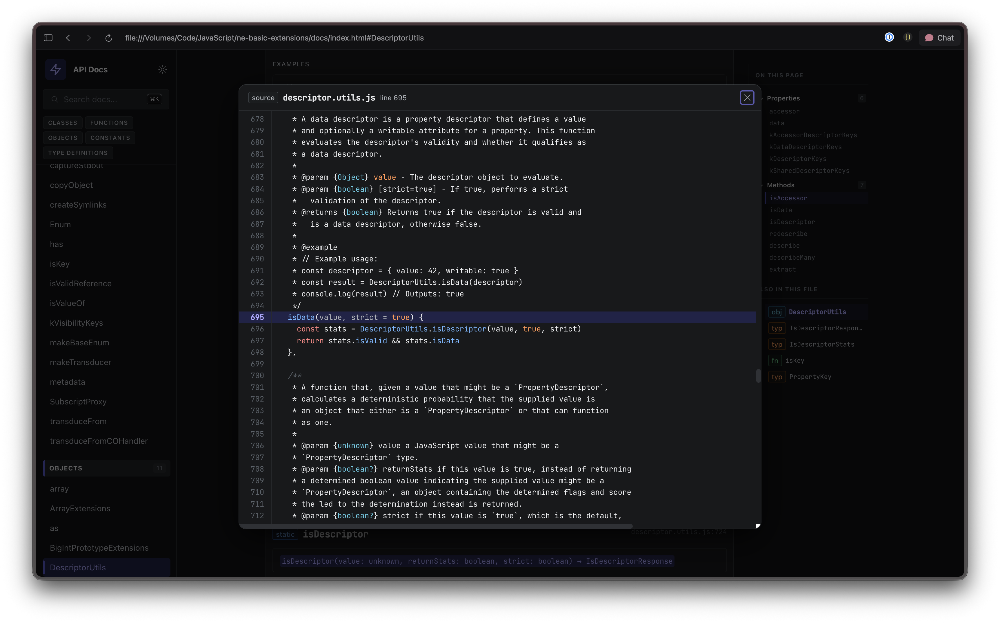
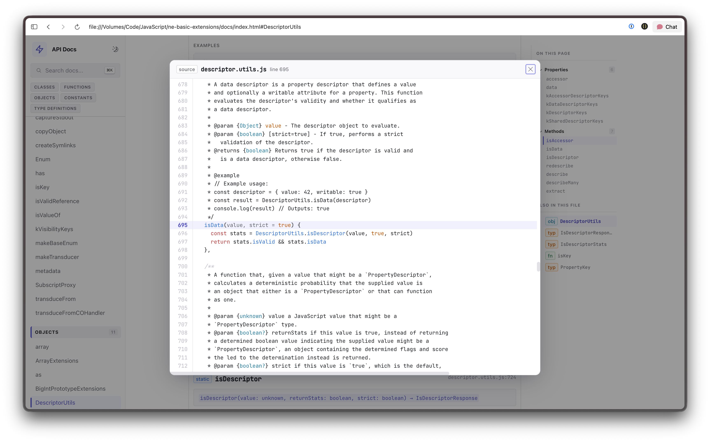

# @nejs/jsdoc-react-theme

A modern JSDoc template built with [React](https://react.dev) and [Radix UI](https://www.radix-ui.com/themes). Generates beautiful API documentation as a single-page app with light/dark mode, full-text search, source code viewer, resizable sidebar, and responsive design.

<p align="center">
  
</p>

## Features

- **Light and dark mode** — Toggle between light and dark themes; respects system preference
- **Radix UI components** — Dialog, Card, Table, Tabs, Badge, ScrollArea, and more
- **Command-K search** — Full-text search across all documented items and their members
- **Source code viewer** — Click any source reference to view syntax-highlighted source with line numbers
- **Page table of contents** — Sticky right-hand navigation showing members and sibling pages from the same file
- **Resizable sidebar** — Drag to resize, double-click to reset, width persists across sessions
- **Syntax highlighting** — highlight.js with theme-aligned color tokens for code examples and source files
- **AST-aware processing** — Discovers exports, Object.assign children, and property attachments that JSDoc misses
- **Responsive** — Collapsible sidebar and page TOC on smaller screens
- **Zero-config CLI** — One command, no jsdoc.json needed
- **Single-page app** — Hash-based routing, no page reloads, works offline with `file://`

## Screenshots

### Dark mode

<p align="center">
  
</p>

### Light mode

<p align="center">
  
</p>

### Source code viewer

Click any source file reference (e.g., `utils.js:42`) to open an in-page source viewer with syntax highlighting and automatic scroll to the referenced line.

<p align="center">
  
</p>

<p align="center">
  
</p>

## Installation

```bash
npm install @nejs/jsdoc-react-theme
```

## Quick Start

The fastest way to generate docs — no config file needed:

```bash
npx jsdoc-react src/
```

This will:
1. Find all `.js`, `.jsx`, `.mjs`, `.cjs` files in `src/` recursively
2. Auto-detect your `README.md`
3. Output documentation to `docs/`
4. Print the path to `index.html` on stdout

## Usage

### CLI (recommended)

```bash
# Basic usage — document a source directory
npx jsdoc-react src/

# Multiple source directories
npx jsdoc-react src/ lib/

# Custom output directory
npx jsdoc-react src/ -o api-docs

# Specify a README explicitly
npx jsdoc-react src/ -r docs/API.md

# Use an existing jsdoc config (theme is auto-applied)
npx jsdoc-react -c jsdoc.json

# Quiet mode for scripting — only stdout output is the index.html path
open $(npx jsdoc-react src/ -q)
```

### CLI Options

#### `<source-dirs...>`

One or more source files or directories to document. The CLI recursively finds all `.js`, `.jsx`, `.mjs`, and `.cjs` files, skipping `node_modules`, `dist`, `build`, and hidden directories. Required unless `-c` is provided.

#### `-o, --output <dir>`

Directory to write the generated documentation to. Created automatically if it doesn't exist. Defaults to `docs`.

```bash
npx jsdoc-react src/ -o api-docs
```

#### `-r, --readme <file>`

Path to a markdown file to use as the home page. If not specified, the CLI auto-detects `README.md`, `readme.md`, `Readme.md`, or `README.markdown` in the current directory.

```bash
npx jsdoc-react src/ -r docs/API.md
```

#### `-c, --config <file>`

Path to an existing JSDoc configuration file (JSON). The theme is automatically injected into the config's `opts.template` field, so you don't need to specify it manually. When using `-c`, source directories are read from the config file and any `<source-dirs>` arguments are optional.

```bash
npx jsdoc-react -c jsdoc.json
```

#### `-q, --quiet`

Suppress all progress output. Only errors are printed to stderr. The path to the generated `index.html` is still printed to stdout, making this ideal for scripting:

```bash
# Open docs in the browser immediately after generation
open $(npx jsdoc-react src/ -q)
```

#### `-v, --verbose`

Show detailed warnings and debug information. When JSDoc encounters type expression parse errors (invalid JSDoc syntax), verbose mode shows the file and line number for each warning.

```bash
npx jsdoc-react src/ -v
```

#### `--version`

Print the version number to stdout and exit.

#### `-h, --help`

Show usage information and exit.

### Exit codes

| Code | Meaning |
|------|---------|
| `0` | Success |
| `1` | JSDoc failed (fatal error during generation) |
| `2` | Usage error (missing arguments, file not found, invalid config) |

### stdout / stderr

The CLI separates machine-readable and human-readable output:

- **stdout** — Only the absolute path to the generated `index.html` (or the version with `--version`). Safe to capture in scripts.
- **stderr** — Progress indicators, warnings, and errors. Automatically uses color and inline status updates when connected to a TTY; degrades gracefully in non-TTY environments.

### Direct JSDoc Usage

If you prefer using JSDoc directly, pass the theme as the template:

```bash
npx jsdoc src/ -t ./node_modules/@nejs/jsdoc-react-theme -d docs
```

Or add it to your `jsdoc.json`:

```json
{
  "source": {
    "include": ["src/"],
    "includePattern": ".+\\.(js|jsx|mjs|cjs)$"
  },
  "opts": {
    "destination": "docs",
    "template": "./node_modules/@nejs/jsdoc-react-theme",
    "recurse": true,
    "readme": "README.md"
  },
  "plugins": ["plugins/markdown"]
}
```

Then run:

```bash
npx jsdoc -c jsdoc.json
```

### npm Scripts

Add to your project's `package.json`:

```json
{
  "scripts": {
    "docs": "jsdoc-react src/ -o docs",
    "docs:open": "open $(jsdoc-react src/ -o docs -q)"
  }
}
```

## What Gets Documented

The theme generates pages for:

- **Classes** — constructor, instance/static methods, instance/static properties, events
- **Interfaces** / **Mixins** — with their members
- **Namespaces** — with nested members
- **Functions** — standalone exported functions
- **Objects** — constants with children (discovered via AST analysis of Object.assign, property literals, etc.)
- **Constants** — standalone values
- **Type definitions** (`@typedef`) and **Events** (`@event`)

Each documented item supports:

- `@param` — rendered as a table with type badges, defaults, and descriptions
- `@returns` / `@throws` — with type badges
- `@example` — syntax-highlighted code blocks (with optional `<caption>`)
- `@type` — type annotation badges
- `@deprecated` — warning notice with optional message
- `@since` — version badge
- `@access` (`@private`, `@protected`) — access badge
- `@async`, `@static`, `@readonly`, `@generator` — modifier badges
- `@see` — see-also links
- `@augments` / `@implements` — inheritance display
- `{@link}` — cross-reference links between documented items

### AST-aware processing

Beyond standard JSDoc, the theme uses Babel to parse your source files and discover structure that JSDoc misses:

- **Object.assign children** — `Object.assign(myObj, { method1, method2 })` attaches `method1` and `method2` as members of `myObj`
- **Object literal children** — `export const utils = { parse() {}, format() {} }` lists `parse` and `format` as methods
- **Property attachments** — `myFn.helperProp = value` shows `helperProp` as a member of `myFn`
- **Re-exports** — `export * from './file'` is followed transitively
- **Class members** — methods and properties discovered from class bodies

## Output

The theme generates a self-contained documentation site:

- `index.html` — the documentation SPA
- `index.js` — bundled React + Radix UI app
- `index.css` — Radix Themes + custom styles
- `content.js` — serialized documentation data + data model

All files work together offline — no server required. Just open `index.html` in a browser.

## Keyboard Shortcuts

| Shortcut | Action |
|----------|--------|
| `Cmd+K` / `Ctrl+K` | Open search |
| `Up` / `Down` | Navigate search results |
| `Enter` | Go to selected result |
| `Escape` | Close search / source viewer |

## Browser Support

The generated documentation works in all modern browsers (Chrome, Firefox, Safari, Edge). No server required — works with `file://` protocol.

## Development

To work on the theme itself:

```bash
git clone <repo-url>
cd jsdoc-react-theme
npm install

# Build the React app
npm run build

# Watch mode (rebuilds on changes)
npm run dev

# Run tests
npm test

# Test against the sample fixture
npx jsdoc test/sample.js -t . -d test/output
open test/output/index.html

# Production build (minified)
npm run build:prod
```

### Architecture

The theme uses a three-layer processing pipeline:

1. **Build phase** — esbuild bundles `src/index.jsx` (React + Radix UI + highlight.js) into `dist/index.js` + `dist/index.css`
2. **Publish phase** — JSDoc calls `publish.js`, which processes doclets via `src/process.js`, highlights source files, embeds everything as JSON into `content.js`, and copies the pre-built `dist/` assets
3. **AST phase** — `src/process-ast.js` parses source files with Babel to discover export structure, children, and property attachments that JSDoc's comment-based analysis misses

The React app reads the embedded data model and renders everything client-side with hash-based routing.

## License

MIT
